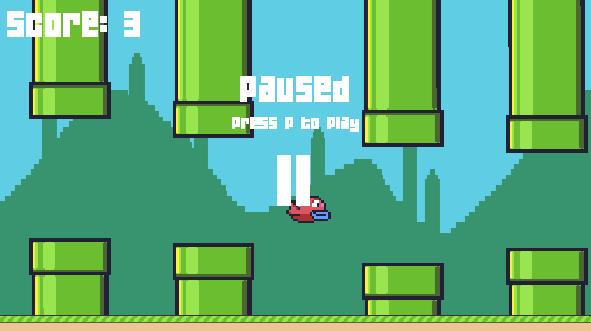

# Fifty Bird - Flappy Bird Clone
This project was not created by me. It was created by Harvard University in the CS50 gaming course. I added features for a project.
These features are listed below and are documented in the code.

## Features I added:
---
- Pause functionality 
- Reward functionality dependant on the score you get
- Made Pipe generation more random in terms of distance between pipes and size of the gap
---

### Adapted Files:
- main.lua
- PipePair.lua
- PauseState.lua
- PlayState.lua
- ScoreState.lua